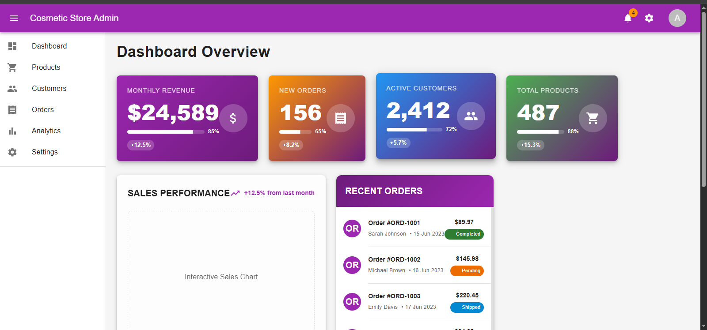
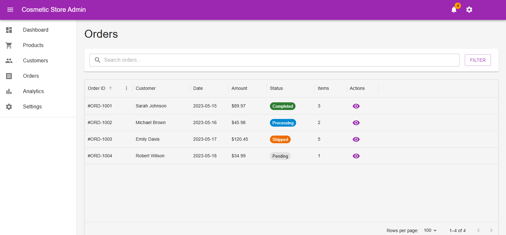
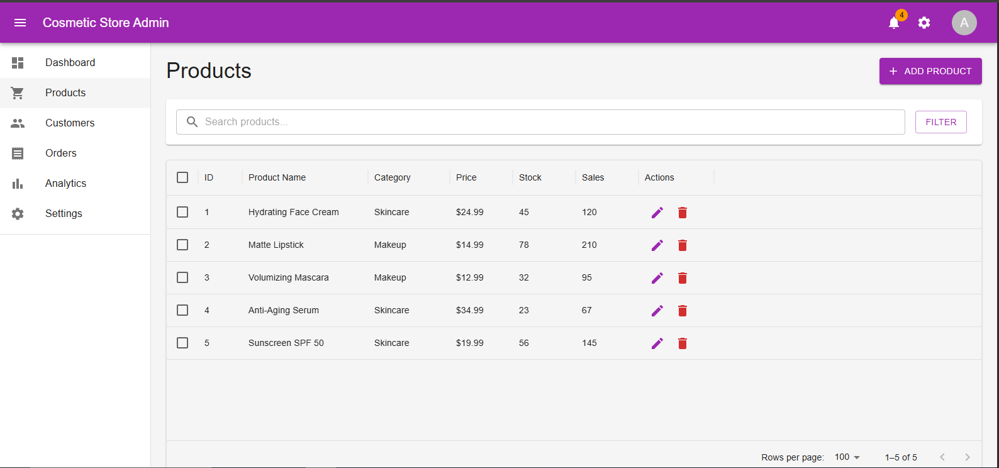
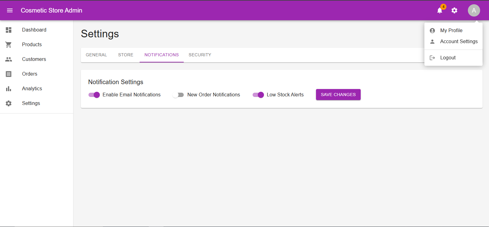

# 💄 Cosmetic Store Admin Dashboard

An elegant and modern admin dashboard built with **React**, **Vite**, and **Material UI (MUI)**. Designed for managing products, customers, orders, and analytics in a cosmetic store.

---

## 📸 Preview






---

## 🚀 Features

- 📦 Product Management
- 👥 Customer Overview
- 📊 Order Tracking
- 📈 Sales & Revenue Stats
- 🔔 Low Stock Alerts
- 🏆 Top-Selling Products
- 🗳️ Feedback Summary
- 🔐 Protected Routes & Authentication
- ⚡️ Vite for blazing fast development
- 💅 Styled with Material UI v5

---

## 🛠️ Tech Stack

- **React 18+**
- **Vite**
- **Material UI (MUI)**
- **React Router**
- **Context API** for auth
- **ESLint + Prettier** for code formatting

---

## 📂 Folder Structure

src/
├── assets/ # Static assets
├── components/ # Reusable layout and route components
├── contexts/ # Global context (auth etc.)
├── pages/ # Pages (Dashboard, Orders, Products, etc.)
├── routes/ # Route definitions
├── App.jsx # Root app entry
└── main.jsx # Vite + React entry point


---

## 🧑‍💻 Getting Started

1. **Clone the repo:**
   ```bash
   git clone https://github.com/HafizBasit7/Cosmetic_Store_Admin.git
   cd Cosmetic_Store_Admin
